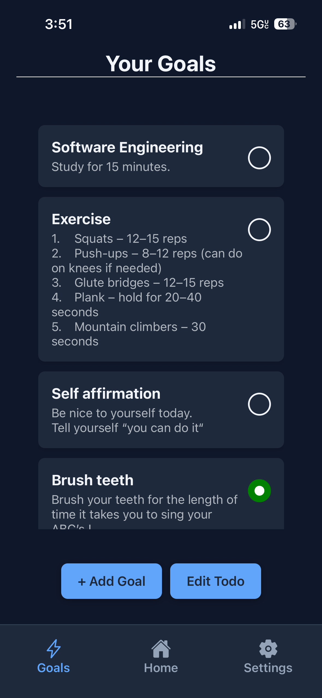
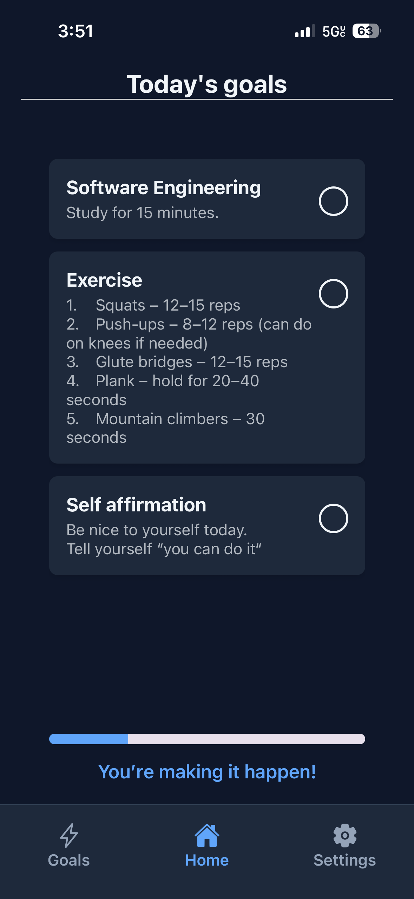

# 📱 Daily Goals App

A simple mobile app to help you stay productive by setting daily goals and checking them off.  
Each day your goals reset so you can come back, complete them again, and build streaks over time.

---

## 🚀 Getting Started

### Prerequisites

- [Node.js](https://nodejs.org/) (>= 16)
- [Expo CLI](https://docs.expo.dev/get-started/installation/)

### Installation

1. Clone the repo:

   ```bash
   git clone https://github.com/taxidriver802/mobileTodo.git
   cd MobileTodo
   ```

2. Install dependencies:

   ```bash
   npm install
   ```

3. Start the project:

   ```bash
   npx expo start
   or
   npx expo start --tunnel
   ```

4. Open the app:
   - Scan the QR code with the Expo Go app (iOS/Android)
   - Or run in emulator (`iOS Simulator` / `Android Studio`)

---

## 📸 Screenshots




---

## 📈 Roadmap

- [ ] Notifications / reminders
- [ ] Cloud sync & login
- [ ] Categories & tags for tasks
- [x] Dark mode toggle

---

## 🤝 Contributing

Contributions are welcome! Feel free to fork the repo and submit a pull request.

---

## 📄 License

This project is licensed under the MIT License.

---

## 👤 Author

**Jason Cox**

- GitHub: [@taxidriver802](https://github.com/taxidriver802)
- Portfolio: [taxidriver802.github.io/portfolio](https://taxidriver802.github.io/portfolio)
